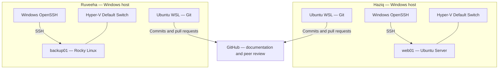
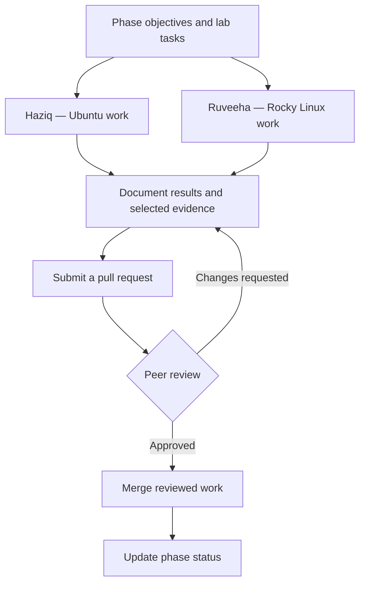

# LinuxOps Enterprise Lab

**Build systems. Verify behavior. Troubleshoot with evidence.**

A two-person Linux administration portfolio project by **[Haziq](https://github.com/HaziqBinAfzal)** and **[Ruveeha](https://github.com/ruveeha33)**.

**Ubuntu · Rocky Linux · Hyper-V · Bash · GitHub**

[Overview](#project-overview) · [Architecture](#lab-architecture) · [Capabilities](#what-we-are-building) · [Phases](#project-phases) · [Evidence](#verified-work-and-evidence)

---

## Project overview

LinuxOps Enterprise Lab is a hands-on project for learning and demonstrating how Linux systems are administered: establishing a baseline, controlling access, managing services and storage, protecting data, monitoring health, automating routine work, and investigating failures.

Haziq works on an Ubuntu server and Ruveeha works on a Rocky Linux server. We practice the same administration topics across both distributions, record what actually happened, and review each other's documentation through GitHub pull requests.

The project follows ten phases. Each phase contains its own overview, objectives, tasks, contributor responsibilities, results, documentation, and selected evidence. The goal is a reproducible record of practical work that another learner or reviewer can follow.

> **Current status:** Phase 01 is completed. Phases 02–10 are planned. This is a learning environment inspired by enterprise administration practices; it is not a production deployment or a completed enterprise platform.

## Why this project exists

Knowing a command is one part of administration. We also want to explain why we used it, interpret its output, diagnose unexpected behavior, verify a change, and leave useful documentation for the next person.

| Project goal | How we approach it |
|---|---|
| Build practical Linux administration experience | Work directly on Ubuntu and Rocky Linux server VMs |
| Understand distribution differences | Document the relevant commands, service behavior, and filesystem choices on each server |
| Practice structured troubleshooting | Record symptoms, investigation, corrective action, and verification |
| Develop automation skills | Plan repeatable Bash checks and scheduled jobs in Phase 08 |
| Demonstrate collaboration | Submit contributions through GitHub pull requests and peer review |
| Create credible portfolio evidence | Link documented results to selected real screenshots and reviewed changes |

## Lab architecture

The lab currently runs on two separate Windows hosts. Hyper-V provides the Linux server VMs; Ubuntu WSL is used for Git operations. Windows OpenSSH provides the verified remote administration path.

**The VMs are on separate Hyper-V Default Switch networks. Inter-host VM connectivity has not been established.** The diagram represents local administration and GitHub collaboration; it does not claim a connected server network.

| Contributor | Server | Operating system | Current purpose | Future lab direction |
|---|---|---|---|---|
| Haziq | `web01` | Ubuntu Server 26.04.1 LTS | Baseline verification and administration | Practice web-service administration |
| Ruveeha | `backup01` | Rocky Linux 9.8 Minimal | Baseline verification and memory troubleshooting | Practice backup administration |

Server names describe intended lab roles. A deployed web service or operational backup service is not claimed at this stage.

## What we are building

| Area | What the lab covers | Status |
|---|---|---|
| Server foundations | OS/kernel identity, sudo, SSH, CPU, memory, storage, network, and systemd health | Documented in Phase 01 |
| Access management | Users, groups, ownership, permissions, umask, ACLs, and sudo policies | Planned — Phase 02 |
| Remote access and network security | SSH configuration, host firewalls, and connectivity diagnostics | Planned — Phase 03 |
| Service operations | Service lifecycle, systemd units, logs, and a practice web service | Planned — Phase 04 |
| Storage administration | Disks, filesystems, mounts, and LVM | Planned — Phase 05 |
| Data protection | Backup scope, repeatable backups, and restore verification | Planned — Phase 06 |
| Operational visibility | Journal investigation, resource checks, and controlled alert investigation | Planned — Phase 07 |
| Automation | Bash administration scripts, job scheduling, and useful execution records | Planned — Phase 08 |
| Incident investigation | Controlled problems, evidence-based diagnosis, fixes, and repeat verification | Planned — Phase 09 |
| Portfolio validation | Configuration review, evidence checks, and a summary of demonstrated capabilities | Planned — Phase 10 |

## Project phases

Start with Phase 01. Open any phase to see its dedicated README and the records available for that stage.

| Phase | Topic | Purpose | Status |
|---|---|---|---|
| 01 | [Server Baseline & Initial Administration](phases/phase-01/README.md) | Establish server identity, access, resources, and health | Completed |
| 02 | [Users, Groups & Permissions](phases/phase-02/README.md) | Practice account management and access controls | Planned |
| 03 | [SSH & Network Security](phases/phase-03/README.md) | Practice remote access and network protection | Planned |
| 04 | [Services & systemd](phases/phase-04/README.md) | Manage and troubleshoot services | Planned |
| 05 | [Storage & LVM](phases/phase-05/README.md) | Manage lab storage and filesystems | Planned |
| 06 | [Backups & Restore Testing](phases/phase-06/README.md) | Protect data and verify recovery | Planned |
| 07 | [Logging & Monitoring](phases/phase-07/README.md) | Observe system state and investigate events | Planned |
| 08 | [Bash Automation & Scheduling](phases/phase-08/README.md) | Make routine administration repeatable | Planned |
| 09 | [Troubleshooting Exercises](phases/phase-09/README.md) | Diagnose and resolve controlled incidents | Planned |
| 10 | [Final Validation & Portfolio](phases/phase-10/README.md) | Review outcomes and supporting evidence | Planned |

## How we work

Each contributor performs lab work on their own server. Documentation records the environment, commands and their purpose, observed results, and any troubleshooting. Selected screenshots support meaningful verification rather than every routine command.

A phase is marked completed after its actual work and verification are documented and peer-reviewed. Planned tasks describe intended work, not demonstrated capabilities.

## Verified work and evidence

Phase 01 records the initial server baselines, administrative access, resource inspection, and systemd health checks. It also documents a real Rocky Linux memory investigation: the guest initially reported approximately **609 MiB**; after disabling Hyper-V Dynamic Memory and restarting, it reported approximately **3.6 GiB** and zero failed systemd units.

| Record | What to inspect |
|---|---|
| [Phase 01 overview](phases/phase-01/README.md) | Completed tasks, contributor responsibilities, and results |
| [Ubuntu baseline](phases/phase-01/docs/web01-baseline.md) | Haziq's `web01` configuration and verification |
| [Rocky Linux baseline](phases/phase-01/docs/backup01-baseline.md) | Ruveeha's `backup01` configuration and verification |
| [Memory troubleshooting](phases/phase-01/docs/memory-troubleshooting.md) | Symptoms, investigation, corrective action, and post-fix checks |
| [Six real screenshots](phases/phase-01/evidence/README.md) | Server health, memory before/after, and merged documentation PRs |

Preview: Haziq's server health verification

Preview: Ruveeha's memory verification after the fix

## Repository guide

| Location | Contents |
|---|---|
| [Main README](README.md) | Project overview, architecture, roadmap, and navigation |
| [Phase 01](phases/phase-01/README.md) | Completed baseline work and results |
| [Phase 01 documentation](phases/phase-01/docs/web01-baseline.md) | Server baselines and the memory troubleshooting report, linked from the phase README |
| [Phase 01 evidence](phases/phase-01/evidence/README.md) | Screenshot index and six original PNGs |
| Phases 02–10 | Dedicated READMEs with planned objectives, tasks, responsibilities, and completion checklists |

## Contributors and reviewed work

| Contributor | Lab focus | Reviewed Phase 01 contribution |
|---|---|---|
| [Haziq](https://github.com/HaziqBinAfzal) | Ubuntu `web01` | [PR #1 — Ubuntu server baseline](https://github.com/HaziqBinAfzal/linuxops-enterprise-lab/pull/1) |
| [Ruveeha](https://github.com/ruveeha33) | Rocky Linux `backup01` | [PR #2 — Rocky Linux baseline and memory troubleshooting](https://github.com/HaziqBinAfzal/linuxops-enterprise-lab/pull/2) |

## Lab boundaries

Resource readings and IP addresses are point-in-time observations. Publish only appropriately reviewed lab evidence; exclude credentials, private keys, tokens, and confidential information. Backup, security, and automation tasks remain planned until their phase records demonstrate completion.
