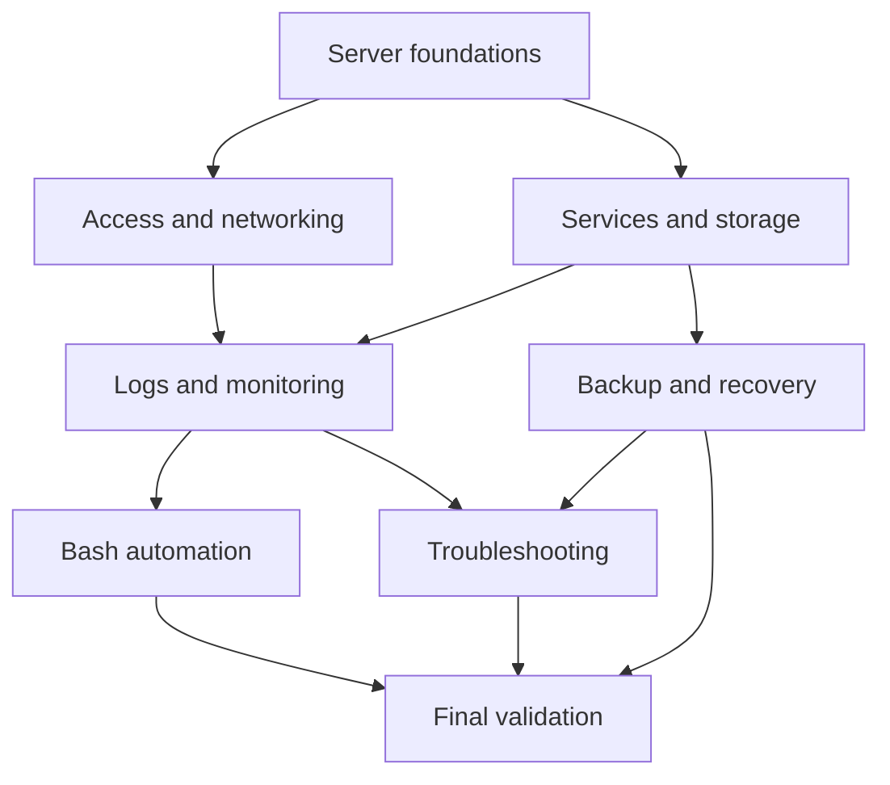
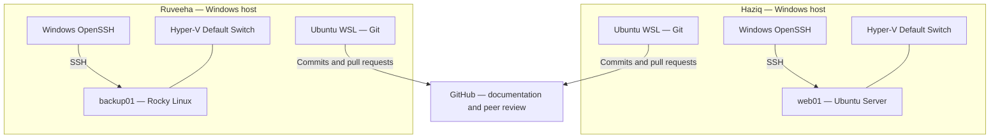
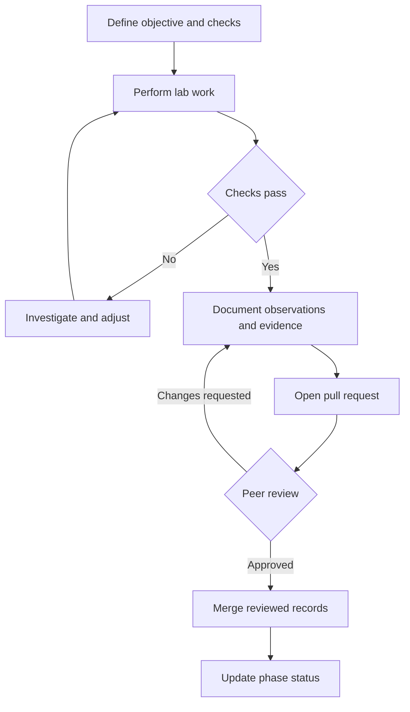
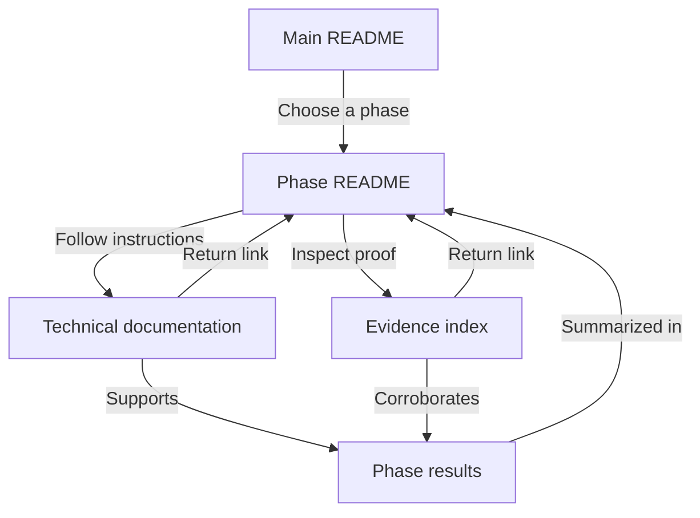

<picture>
  <source media="(prefers-color-scheme: dark)" srcset="docs/assets/linuxops-logo-dark.png">
  
</picture>

# LinuxOps Enterprise Lab

**Build systems. Verify behavior. Troubleshoot with evidence.**

**Ubuntu · Rocky Linux · Hyper-V · Bash · GitHub**

[Overview](#project-overview) · [Purpose](#why-we-are-building-it) · [Phases](#project-phases) · [Environment](#lab-environment) · [Tools](#tools-and-their-purpose) · [Workflow](#how-we-work) · [Navigation](#repository-navigation)

---

## Project overview

LinuxOps Enterprise Lab is a hands-on Linux administration project by Haziq and Ruveeha. We work on Ubuntu Server and Rocky Linux virtual machines, learn how systems operate, and document our work through peer-reviewed GitHub contributions.

The project covers server administration, access control, networking, services, storage, backup and recovery, monitoring, automation, and troubleshooting. Our approach is to explain commands, interpret results, verify changes, and retain meaningful evidence.

### What the project is

It is a structured lab and a growing record of our Linux administration work. The virtual machines provide the systems we administer; this repository explains the work, records observations, and organizes the supporting evidence. The project grows as we perform and review each exercise.

### Who it is for

The repository is written for learners following our approach, collaborators reviewing our changes, and technical reviewers assessing how we reason about systems. Readers should be able to understand the environment, find the relevant procedure, and distinguish demonstrated results from intended work.

### What “Enterprise Lab” means

We use practices relevant to professional administration: controlled changes, access management, verification, recovery planning, useful records, and peer review. The name describes the learning direction. The lab runs on personal hosts and is not a production enterprise deployment.

## Why we are building it

### Turn knowledge into practical experience

We want to connect Linux concepts to real system behavior. That means understanding what a command checks, why its output matters, and what to investigate when the result differs from expectations.

### Learn across two Linux distributions

Working with Ubuntu and Rocky Linux helps us compare administration approaches, package management, service behavior, and configuration choices. We document the differences where they affect the exercise rather than assume one command works identically everywhere.

### Practice troubleshooting and collaboration

Administration includes handling unexpected behavior and communicating the fix. We aim to record symptoms, investigation, changes, and verification, then have the other contributor review the explanation and evidence.

### Build a reviewable portfolio

The intended outcome is a body of work that shows our approach to administration. A reviewer should be able to follow our reasoning and inspect supporting records, rather than rely on a list of claimed skills.

## What the project covers

These are the project's learning areas. Their inclusion describes scope; completion is tracked in the phase directory below.

| Area | What we aim to understand |
|---|---|
| Server administration | System identity, resources, privileges, and baseline health |
| Access control | Users, groups, permissions, and who can perform an operation |
| Remote access and networking | SSH, connectivity, and protection of administration access |
| Services | Service state, startup behavior, dependencies, and failure investigation |
| Storage | Disks, logical volumes, filesystems, capacity, and mounts |
| Backup and recovery | Protecting selected data and proving that it can be restored |
| Observability | Using logs and health readings to understand system behavior |
| Automation | Repeatable Bash tasks and scheduled administration |
| Troubleshooting | Investigating controlled problems and verifying recovery |
| Documentation | Clear procedures, evidence, peer review, and final validation |

## How the phases fit together

The project is divided into ten stages so that each topic has a focused workspace. Foundations come first; later stages build toward managing services and data, observing behavior, automating routine work, and validating outcomes.

**This main README explains the project as a whole.** Open a phase for its objectives, tasks, command explanations, technical records, results, and screenshots.

### Learning areas and their relationships

This map shows how the subjects support one another. It describes the curriculum, not completed infrastructure.

## Project phases

| Phase | Topic | Status |
|---|---|---|
| 01 | [Server Baseline & Initial Administration](phases/phase-01/README.md) | Completed |
| 02 | [Users, Groups & Permissions](phases/phase-02/README.md) | Planned |
| 03 | [SSH & Network Security](phases/phase-03/README.md) | Planned |
| 04 | [Services & systemd](phases/phase-04/README.md) | Planned |
| 05 | [Storage & LVM](phases/phase-05/README.md) | Planned |
| 06 | [Backups & Restore Testing](phases/phase-06/README.md) | Planned |
| 07 | [Logging & Monitoring](phases/phase-07/README.md) | Planned |
| 08 | [Bash Automation & Scheduling](phases/phase-08/README.md) | Planned |
| 09 | [Troubleshooting Exercises](phases/phase-09/README.md) | Planned |
| 10 | [Final Validation & Portfolio](phases/phase-10/README.md) | Planned |

> [!NOTE]
> This is a learning lab inspired by enterprise administration practices. Planned phases describe intended work; their capabilities have not yet been demonstrated.

## Lab environment

Each contributor runs a Linux server VM on a separate Windows host using Hyper-V. Windows OpenSSH supports local remote administration, and Ubuntu WSL supports Git operations.

The VMs use separate Hyper-V Default Switch networks. Inter-host VM connectivity has not been established.

### The Windows hosts

Each contributor's Windows computer hosts their own lab. Keeping separate environments lets both contributors perform the work and compare observations rather than share a single terminal session.

### The Linux virtual machines

Hyper-V runs the server guests. These VMs are the administration targets. Their names, `web01` and `backup01`, indicate intended lab roles; the names alone do not demonstrate deployed web or backup services.

### WSL and SSH have different roles

Ubuntu WSL provides a Linux environment for repository work. Windows OpenSSH connects to the Linux VMs for administration. The WSL environment and the server VM are separate systems, so commands must be run in the environment identified by the procedure.

### Network boundaries

The architecture shows local access on each host and collaboration through GitHub. The two Linux guests have not been established as a connected server network. Network design changes will be documented when performed.

## Tools and their purpose

| Tool or environment | Role in the project |
|---|---|
| Ubuntu Server | Haziq's Linux administration environment |
| Rocky Linux | Ruveeha's Linux administration environment |
| Hyper-V | Runs and configures the Linux virtual machines |
| Windows OpenSSH | Provides SSH access from each Windows host to its guest |
| Ubuntu WSL | Supports Git and repository work on Windows |
| Linux command line | Provides system inspection and administration commands |
| Bash | Shell used for command-line work and planned automation |
| Git | Tracks changes and organizes contributions into commits and branches |
| GitHub | Hosts documentation, evidence, pull requests, and peer review |
| Markdown and Mermaid | Present readable documentation and architecture diagrams |

## How we work

### From lab work to reviewed documentation

Verification and peer review both have a correction path. An unexpected result sends us back to investigate; review feedback sends the record back for improvement.

### Plan the exercise

We identify the objective, the environment involved, the expected behavior, and the checks needed to assess the result. Planned work is kept visible without presenting it as completed.

### Perform and explain the work

Each contributor works in their own environment. Technical documentation explains a command's purpose, expected output, observed output where available, and interpretation. Differences and uncertainties are recorded where they affect the result.

### Verify the outcome

A change needs a relevant check. Verification should show whether the intended behavior occurred and identify what remains untested. Resource readings and addresses are treated as observations at a particular time.

### Retain useful evidence

We select screenshots that support meaningful results or troubleshooting. Captions explain what they show and their limits. Screenshots supplement the written procedure; they do not automatically prove every claim on a page.

### Review and publish the records

Contributions are committed to Git, submitted through pull requests, and reviewed by the other contributor. Corrections become part of the record, and phase status reflects the documented work.

## Documentation and evidence approach

### Procedures

Procedures help a reader carry out an exercise with enough explanation to understand the actions. A reconstruction guide is identified separately from a transcript of historical work.

### Results

Results describe what was observed in our environment. Expected outcomes, actual observations, and work awaiting validation are distinguished so a reader can assess the evidence fairly.

### Troubleshooting records

An investigation should connect the symptom to the checks performed, the change made, and the post-change verification. Conclusions should stay within what the retained records support.

### Evidence

Original screenshots stay with their phase and are indexed with explanatory captions. Evidence should exclude credentials, private keys, tokens, and confidential information. Evidence limitations belong alongside the relevant claims.

## Project status and boundaries

The repository currently contains documentation and evidence. **Phase 01 is Completed; Phases 02–10 are Planned.** Future service configurations, administration scripts, backup restore results, and automation outputs will be added as that work is performed.

This is an evolving learning project. It does not claim production readiness, a completed enterprise platform, or successful execution of every future exercise. Detailed validation limits are documented within the relevant phase.

## Repository navigation

| Location | What belongs there |
|---|---|
| Main README | Project overview and phase navigation |
| Each phase README | Objectives, tasks, contributor responsibilities, status, and results |
| Phase documentation | Explained procedures, technical records, and troubleshooting |
| Phase evidence | Real screenshots, captions, and evidence limits |

### How the records connect

The main README directs readers to a phase overview. Procedures and evidence support the results recorded there, while return links keep the reader oriented.

### How to browse

Start with the phase directory above. Read the selected phase README first, then follow its documentation and evidence links. Return links on technical pages help you navigate back to the phase overview.

## Contributors

| Contributor | Environment | Shared responsibility |
|---|---|---|
| [Haziq](https://github.com/HaziqBinAfzal) | Ubuntu Server | Lab work, explanations, evidence, and peer review |
| [Ruveeha](https://github.com/ruveeha33) | Rocky Linux | Lab work, explanations, evidence, and peer review |

---

**LinuxOps Enterprise Lab** · Haziq & Ruveeha  
[Browse the phases](#project-phases) · [Back to top](#linuxops-enterprise-lab)

