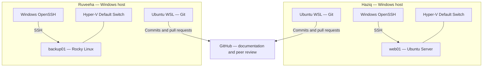

<picture>
  <source media="(prefers-color-scheme: dark)" srcset="docs/assets/linuxops-logo-dark.png">
  
</picture>

# LinuxOps Enterprise Lab

**Build systems. Verify behavior. Troubleshoot with evidence.**

**Ubuntu · Rocky Linux · Hyper-V · Bash · GitHub**

[Overview](#project-overview) · [Phases](#project-phases) · [Lab environment](#lab-environment) · [Contributors](#contributors)

---

## Project overview

LinuxOps Enterprise Lab is a hands-on Linux administration project by Haziq and Ruveeha. We work on Ubuntu Server and Rocky Linux virtual machines, learn how systems operate, and document our work through peer-reviewed GitHub contributions.

The project covers server administration, access control, networking, services, storage, backup and recovery, monitoring, automation, and troubleshooting. Our approach is to explain commands, interpret results, verify changes, and retain meaningful evidence.

This README introduces the project. **Open a phase below for its objectives, tasks, procedures, results, and screenshots.**

## Project phases

| Phase | Topic | Status |
|---|---|---|
| 01 | [Server Baseline & Initial Administration](phases/phase-01/README.md) | Completed |
| 02 | [Users, Groups & Permissions](phases/phase-02/README.md) | Planned |
| 03 | [SSH & Network Security](phases/phase-03/README.md) | Planned |
| 04 | [Services & systemd](phases/phase-04/README.md) | Planned |
| 05 | [Storage & LVM](phases/phase-05/README.md) | Planned |
| 06 | [Backups & Restore Testing](phases/phase-06/README.md) | Planned |
| 07 | [Logging & Monitoring](phases/phase-07/README.md) | Planned |
| 08 | [Bash Automation & Scheduling](phases/phase-08/README.md) | Planned |
| 09 | [Troubleshooting Exercises](phases/phase-09/README.md) | Planned |
| 10 | [Final Validation & Portfolio](phases/phase-10/README.md) | Planned |

> [!NOTE]
> This is a learning lab inspired by enterprise administration practices. Planned phases describe intended work; their capabilities have not yet been demonstrated.

## Lab environment

Each contributor runs a Linux server VM on a separate Windows host using Hyper-V. Windows OpenSSH supports local remote administration, and Ubuntu WSL supports Git operations.

The VMs use separate Hyper-V Default Switch networks. Inter-host VM connectivity has not been established.

## How we work

Haziq and Ruveeha perform lab exercises, explain the commands and observations, capture selected evidence, and review each other's contributions through pull requests. Each phase keeps its own documentation and verification records together.

## Repository navigation

| Location | What belongs there |
|---|---|
| Main README | Project overview and phase navigation |
| Each phase README | Objectives, tasks, contributor responsibilities, status, and results |
| Phase documentation | Explained procedures, technical records, and troubleshooting |
| Phase evidence | Real screenshots, captions, and evidence limits |

## Contributors

| Contributor | Environment |
|---|---|
| [Haziq](https://github.com/HaziqBinAfzal) | Ubuntu Server |
| [Ruveeha](https://github.com/ruveeha33) | Rocky Linux |

---

**LinuxOps Enterprise Lab** · Haziq & Ruveeha  
[Browse the phases](#project-phases) · [Back to top](#linuxops-enterprise-lab)

