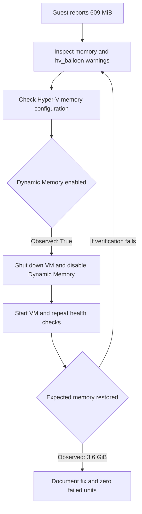

<picture>
  <source media="(prefers-color-scheme: dark)" srcset="../../docs/assets/linuxops-logo-dark.png">
  
</picture>

# Phase 01: Server Baseline & Initial Administration

**Status: Completed**

[Project overview](../../README.md) · [Objectives](#objectives) · [Results](#verified-results) · [Documentation](#documentation) · [Evidence](#evidence) · [Next: Phase 02](../phase-02/README.md)

---

> [!NOTE]
> The phase records completed baseline work. Screenshots independently support selected health and memory checks; other details are contributor observations. The reconstruction guide still awaits a fresh-build validation.

## Phase overview

A baseline is the initial record of a server's identity, access, resources, and health. It provides a reference for later changes: if behavior changes, we can compare new observations with the starting point.

This phase establishes that reference on Haziq's Ubuntu VM and Ruveeha's Rocky Linux VM. It combines historical baseline records with a separate reconstruction guide for readers building a comparable environment.

## Follow this lab yourself

**New to Linux? [Follow the complete Phase 01 tutorial, step by step](docs/follow-along-lab.md).** It includes the exact commands to run on Windows, Ubuntu or Rocky Linux, why each command matters, and how to check the result.

You can build **one Ubuntu or Rocky Linux VM** and follow the same baseline verification process. You do not need access to our computers, IP addresses, or GitHub write permissions.

**[Start the step-by-step setup and command guide](docs/setup-guide.md#quick-start-for-readers)**

The guide separates Windows PowerShell, Linux guest terminals, and optional WSL Git commands. It explains the commands, expected observations, and how to handle differences. Use the [fresh-build validation record](docs/fresh-build-validation.md) to document your own results.

> The original Phase 1 observations are completed and documented. The public reconstruction instructions are provided for learning, but a separate fresh-build test has **not yet been recorded**. Do not treat the historical screenshots as proof that a new installation passed.

## Reading paths

| Reader | Suggested order |
|---|---|
| New learner | Objectives → setup guide → fresh-build validation |
| Technical reviewer | Results → baseline records → evidence coverage |
| Troubleshooting reader | Memory workflow → incident report → evidence index |

## Start here

| Goal | Document |
|---|---|
| Recreate the environment | [Setup guide](docs/setup-guide.md) · [Pending validation](docs/fresh-build-validation.md) |
| Compare the two servers | [Ubuntu baseline](docs/web01-baseline.md) · [Rocky Linux baseline](docs/backup01-baseline.md) |
| Follow the memory investigation | [Incident report](docs/memory-troubleshooting.md) |
| Check supporting proof | [Evidence index](evidence/README.md) · [Coverage limits](docs/evidence-coverage.md) |

## Objectives

Set up two Linux server VMs, establish administrative access, inspect baseline resource and service health, troubleshoot observed issues, and document the results.

## Lab servers and contributors

| Contributor | Server | OS | Contribution |
|---|---|---|---|
| [Haziq](https://github.com/HaziqBinAfzal) | `web01` | Ubuntu Server 26.04.1 LTS | Server identity, sudo/SSH, CPU, memory, disk, network, and systemd verification |
| [Ruveeha](https://github.com/ruveeha33) | `backup01` | Rocky Linux 9.8 Minimal | Rocky Linux baseline, LVM/XFS inspection, and Hyper-V memory troubleshooting |

## What the baseline checks tell us

| Check area | Question it answers |
|---|---|
| Identity | Are we inspecting the intended server rather than WSL or another guest? |
| Privileges and access | Can the intended administrator perform authorized work and reach the guest? |
| Resources and storage | What CPU, memory, swap, and mounted filesystem capacity does the guest expose? |
| Service state | Are any systemd units currently marked failed? |
| Host/guest comparison | Does guest behavior agree with the VM configuration? |

Command purposes and interpretation are explained in the baseline documents and setup guide. A successful check answers its specific question; it does not establish overall production readiness.

## Completed tasks

- Installed and updated the server operating systems.
- Verified administrative privileges and SSH access.
- Recorded kernel, CPU, RAM, swap, storage, filesystem, and network details.
- Checked systemd for failed units.
- Investigated Rocky Linux showing 609 MiB of guest-visible RAM with `hv_balloon` warnings.
- Disabled Hyper-V Dynamic Memory and verified approximately 3.6 GiB of guest-visible RAM.
- Submitted, peer-reviewed, and merged the Phase 1 documentation through two pull requests.

## Verified results

| Area | Haziq — `web01` | Ruveeha — `backup01` |
|---|---|---|
| Virtualization | Hyper-V VM | Hyper-V VM |
| Virtual CPUs | 2 | 2 |
| Guest-visible memory | Approximately 3.3 GiB | Approximately 3.6 GiB after the fix |
| Root filesystem | ext4 on LVM | XFS on LVM |
| Administrative access | sudo and SSH verified | sudo and SSH verified |
| Service health | Zero failed systemd units | Zero failed systemd units |
| Troubleshooting | Baseline health documented | Investigated 609 MiB RAM and corrected Hyper-V Dynamic Memory |

These results combine contributor-recorded observations with selected screenshot-backed checks. The [coverage matrix](docs/evidence-coverage.md) identifies which is which.

Resource readings are point-in-time observations. The servers use separate Hyper-V Default Switch networks; inter-host VM connectivity is not yet established. Each contributor uses Ubuntu WSL for Git operations.

## Memory troubleshooting workflow

The investigation compared guest readings with host configuration and verified the result after changing Dynamic Memory.

The successful path is recorded in the [incident report](docs/memory-troubleshooting.md). The retry branch describes how to continue investigation if a check fails; it is not an additional incident claim.

## Documentation

| Record | Purpose |
|---|---|
| [Setup and verification guide](docs/setup-guide.md) | Reconstruct a comparable lab with explained commands |
| [Fresh-build validation](docs/fresh-build-validation.md) | Unexecuted checklist; no successful rebuild claimed |
| [Ubuntu baseline](docs/web01-baseline.md) | Haziq's server observations and their interpretation |
| [Rocky Linux baseline](docs/backup01-baseline.md) | Ruveeha's server observations and their interpretation |
| [Memory troubleshooting](docs/memory-troubleshooting.md) | Symptoms, investigation, change, and post-fix checks |
| [Evidence coverage](docs/evidence-coverage.md) | Screenshot-backed checks and documented observations |

## Evidence

[Browse the Phase 1 evidence index](evidence/README.md). Six real screenshots document server health, the memory investigation and fix, and the merged documentation PRs.

## GitHub collaboration

- [PR #1 — Ubuntu baseline](https://github.com/HaziqBinAfzal/linuxops-enterprise-lab/pull/1)
- [PR #2 — Rocky Linux baseline and troubleshooting](https://github.com/HaziqBinAfzal/linuxops-enterprise-lab/pull/2)

## Reproduction and evidence limits

The baseline documents record historical results. The setup guide describes how to construct a comparable new lab and validate it. Exact original ISO filenames/checksums, installer choices, VM generation, and installation/update transcripts were not preserved in the current selected evidence; those details must not be inferred from the screenshots.

## What we learned

Linux administration involves verifying system state, understanding how virtualization affects guests, troubleshooting with evidence, documenting changes, and peer-reviewing work.
