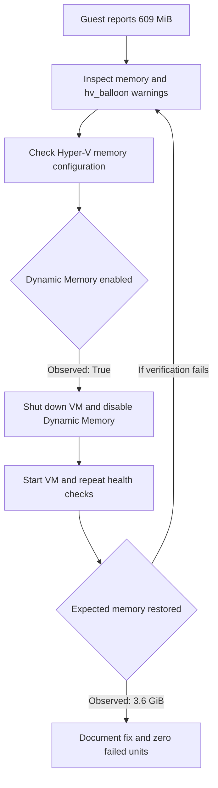

# Phase 01 — Server Baseline & Initial Administration

**Status: Completed**

[Project overview](../../README.md) · [Objectives](#objectives) · [Results](#verified-results) · [Documentation](#documentation) · [Evidence](#evidence) · [Next: Phase 02](../phase-02/README.md)

---

## Objectives

Set up two Linux server VMs, establish administrative access, inspect baseline resource and service health, troubleshoot observed issues, and document the results.

## Lab servers and contributors

| Contributor | Server | OS | Contribution |
|---|---|---|---|
| [Haziq](https://github.com/HaziqBinAfzal) | `web01` | Ubuntu Server 26.04.1 LTS | Server identity, sudo/SSH, CPU, memory, disk, network, and systemd verification |
| [Ruveeha](https://github.com/ruveeha33) | `backup01` | Rocky Linux 9.8 Minimal | Rocky Linux baseline, LVM/XFS inspection, and Hyper-V memory troubleshooting |

## Completed tasks

- Installed and updated the server operating systems.
- Verified administrative privileges and SSH access.
- Recorded kernel, CPU, RAM, swap, storage, filesystem, and network details.
- Checked systemd for failed units.
- Investigated Rocky Linux showing 609 MiB of guest-visible RAM with `hv_balloon` warnings.
- Disabled Hyper-V Dynamic Memory and verified approximately 3.6 GiB of guest-visible RAM.
- Submitted, peer-reviewed, and merged the Phase 1 documentation through two pull requests.

## Verified results

| Area | Haziq — `web01` | Ruveeha — `backup01` |
|---|---|---|
| Virtualization | Hyper-V VM | Hyper-V VM |
| Virtual CPUs | 2 | 2 |
| Guest-visible memory | Approximately 3.3 GiB | Approximately 3.6 GiB after the fix |
| Root filesystem | ext4 on LVM | XFS on LVM |
| Administrative access | sudo and SSH verified | sudo and SSH verified |
| Service health | Zero failed systemd units | Zero failed systemd units |
| Troubleshooting | Baseline health documented | Investigated 609 MiB RAM and corrected Hyper-V Dynamic Memory |

Resource readings are point-in-time observations. The servers use separate Hyper-V Default Switch networks; inter-host VM connectivity is not yet established. Each contributor uses Ubuntu WSL for Git operations.

## Memory troubleshooting workflow

The investigation compared guest readings with host configuration and verified the result after changing Dynamic Memory.

The successful path is recorded in the [incident report](docs/memory-troubleshooting.md). The retry branch describes how to continue investigation if a check fails; it is not an additional incident claim.

## Documentation

- [Setup and verification guide](docs/setup-guide.md) — a reconstruction procedure for a new lab, not a transcript of the original installation.
- [Evidence coverage](docs/evidence-coverage.md) — what the screenshots corroborate and what remains a documented observation.
- [Haziq: Ubuntu `web01` baseline](docs/web01-baseline.md)
- [Ruveeha: Rocky Linux `backup01` baseline](docs/backup01-baseline.md)
- [Ruveeha: Hyper-V memory troubleshooting](docs/memory-troubleshooting.md)

## Evidence

[Browse the Phase 1 evidence index](evidence/README.md). Six real screenshots document server health, the memory investigation and fix, and the merged documentation PRs.

## GitHub collaboration

- [PR #1 — Ubuntu baseline](https://github.com/HaziqBinAfzal/linuxops-enterprise-lab/pull/1)
- [PR #2 — Rocky Linux baseline and troubleshooting](https://github.com/HaziqBinAfzal/linuxops-enterprise-lab/pull/2)

## Reproduction and evidence limits

The baseline documents record historical results. The setup guide describes how to construct a comparable new lab and validate it. Exact original ISO filenames/checksums, installer choices, VM generation, and installation/update transcripts were not preserved in the current selected evidence; those details must not be inferred from the screenshots.

## What we learned

Linux administration involves verifying system state, understanding how virtualization affects guests, troubleshooting with evidence, documenting changes, and peer-reviewing work.
