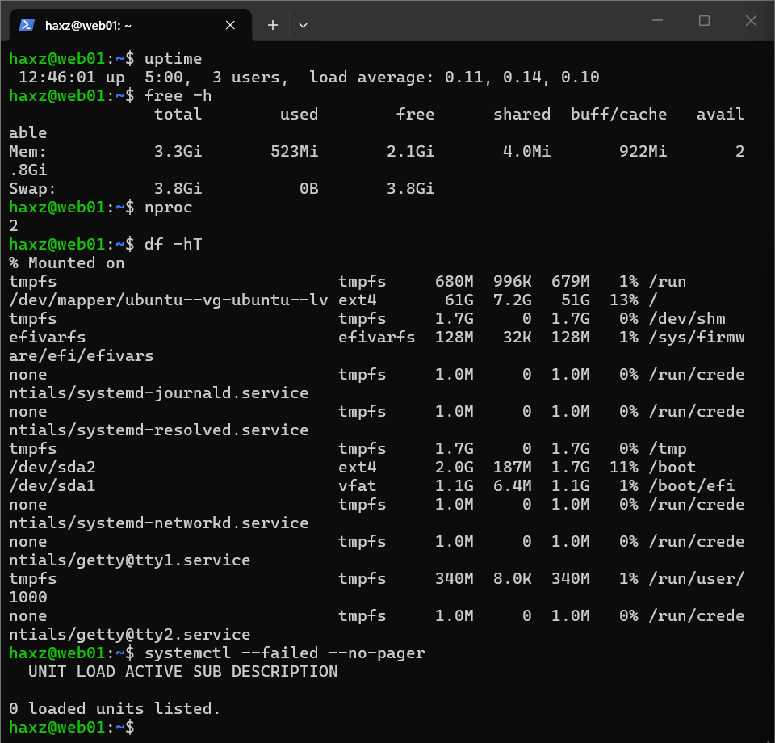
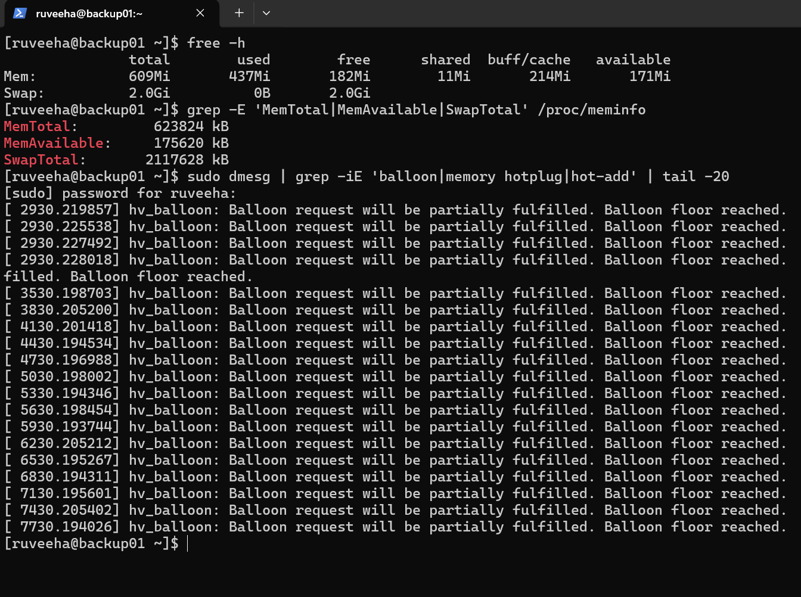
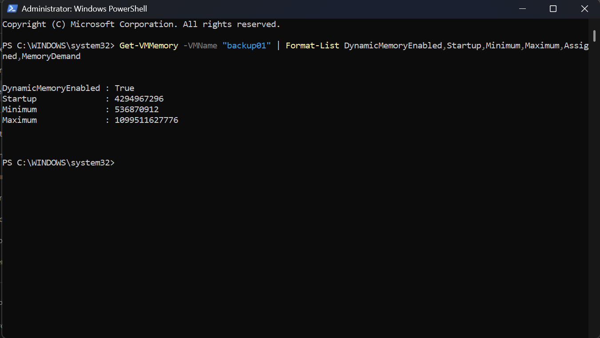
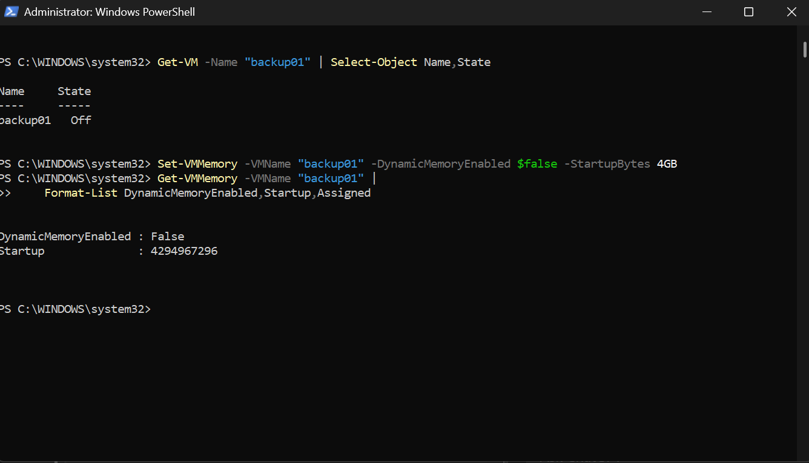
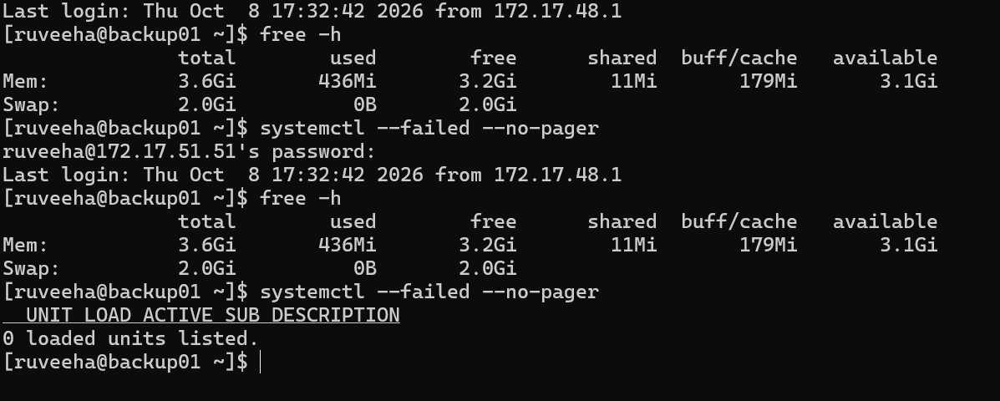
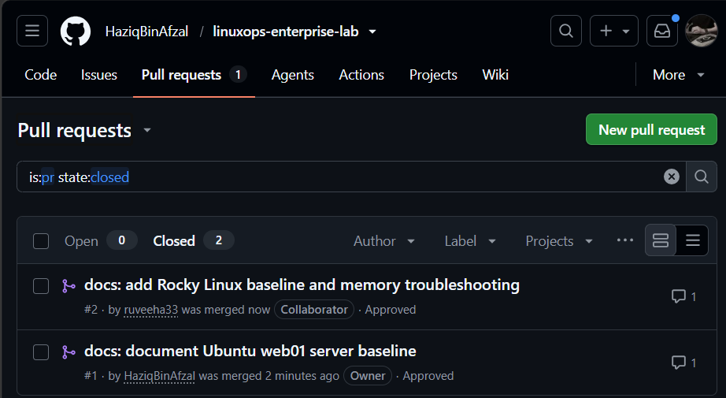

# Phase 01 — Screenshot Evidence

[← Phase 01 overview](../README.md)

Six selected real Phase 1 screenshots are available below. These are point-in-time records from the lab and GitHub collaboration.

| Evidence | What it shows |
|---|---|
| [haziq-web01-health.png](haziq-web01-health.png) | Ubuntu server uptime, CPU, memory, filesystems, and systemd health |
| [ruveeha-memory-before.png](ruveeha-memory-before.png) | Rocky Linux guest showing 609 MiB RAM and Hyper-V balloon warnings |
| [ruveeha-hyperv-before.png](ruveeha-hyperv-before.png) | Hyper-V Dynamic Memory enabled |
| [ruveeha-hyperv-after.png](ruveeha-hyperv-after.png) | PowerShell change disabling Dynamic Memory |
| [ruveeha-memory-after.png](ruveeha-memory-after.png) | Guest showing approximately 3.6 GiB RAM and zero failed systemd units |
| [github-merged-prs.png](github-merged-prs.png) | Both Phase 1 documentation PRs approved and merged |

See the [memory troubleshooting report](../docs/memory-troubleshooting.md) for the detailed incident record.

## Coverage limits

The screenshots directly support selected resource readings, Hyper-V memory settings, and GitHub review/merge outcomes. They do not independently establish every OS/kernel, account, storage, SSH configuration, or package-update detail in the baselines. See the [evidence coverage matrix](../docs/evidence-coverage.md). No additional evidence has been fabricated.

## Screenshot previews

Previews are scaled to 640 pixels wide, preserving each image's proportions. Open the original for small text or a full-resolution view.

Haziq — Ubuntu server health

[Open full-size screenshot](haziq-web01-health.png)

Ruveeha — guest memory before the fix

[Open full-size screenshot](ruveeha-memory-before.png)

Ruveeha — Hyper-V settings before the fix

[Open full-size screenshot](ruveeha-hyperv-before.png)

Ruveeha — Hyper-V settings after the fix

[Open full-size screenshot](ruveeha-hyperv-after.png)

Ruveeha — guest memory and health after the fix

[Open full-size screenshot](ruveeha-memory-after.png)

GitHub — approved and merged documentation PRs

[Open full-size screenshot](github-merged-prs.png)

