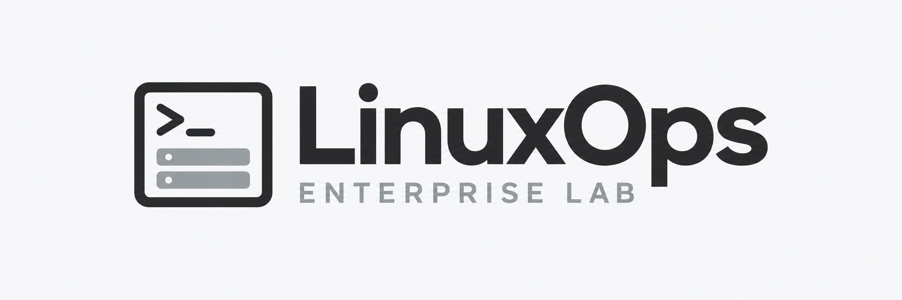

<picture>
  <source media="(prefers-color-scheme: dark)" srcset="../../docs/assets/linuxops-logo-dark.png">
  
</picture>

# Phase 05 — Storage & LVM

**Status: Planned**

[Project overview](../../README.md) · [Previous: Phase 04](../phase-04/README.md) · [Next: Phase 06](../phase-06/README.md)

---

## Overview

Inspect disks and filesystems; practice logical volume management and safe storage changes.

## Objectives and planned tasks

| Area | Planned task | Intended verification |
|---|---|---|
| Storage inventory | Inspect disks, partitions, filesystems, and logical volumes. | Document the lab storage layout. |
| LVM practice | Practice logical volume changes on designated lab storage. | Verify sizes and filesystem state. |
| Mount management | Practice filesystem mounts and configuration. | Validate mount behavior. |

These activities describe intended work. Commands and detailed procedures will be added when this phase begins.

## Acceptance criteria — planned

These are requirements for future verification, not completed test results.

| Check | Required evidence for completion |
|---|---|
| Inventory | Record lsblk, LVM inventory, and mounted filesystem output before a change. |
| LVM change | Use designated disposable storage; record before/after LV size and filesystem size, not only one of them. |
| Persistence | Verify the intended mount after reboot and record its device, mount point, and filesystem. |
| Data integrity | Compare hashes of a test file before and after the storage change. |

## Contributor responsibilities

| Contributor | Lab server | Planned responsibility |
|---|---|---|
| [Haziq](https://github.com/HaziqBinAfzal) | Ubuntu `web01` | Perform the phase activities, document results, and review Ruveeha's contribution. |
| [Ruveeha](https://github.com/ruveeha33) | Rocky Linux `backup01` | Perform the phase activities, document results, and review Haziq's contribution. |

## Results

Not started. No completion or validation claims are made for this phase.

## Documentation and evidence

Technical notes and selected screenshots will be added here after work is performed and verified. No evidence is available yet.

## Completion checklist

- [ ] Perform the planned lab activities.
- [ ] Verify and document actual results.
- [ ] Record meaningful troubleshooting, if needed.
- [ ] Add selected evidence with sensitive information redacted.
- [ ] Submit a pull request and complete peer review.
